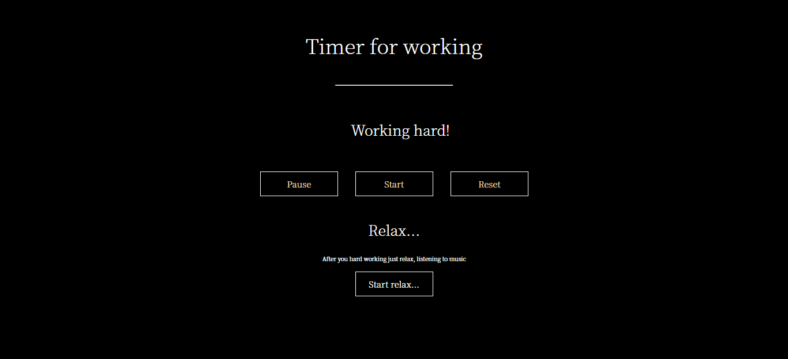
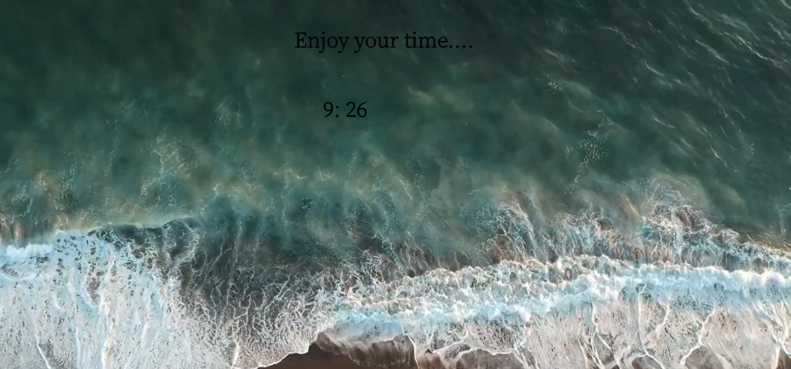

<h1>TIMER FOR WORK</h1>

The main aim  is to create the simple timer for the son who is the pupil to make his learning more efficient and learn him to manage his time.
 

<h3>Features</h3>
- The timer has the limited time for work (45 minutes) and time for relax (10 minutes);  
- has the stopwach;
- start,pause and reset countdown on tasks;  
- when you relax you can take in the sea view and waves sounds crashing on the sea shore during 10 minutes; 

<h3>Usage</h3>
- This online timer is very simple to use;  
- has the strict look and doesn't take off the work;  
<h3>Contributing</h3>
Bug reports and/or pull requests are welcome.

-----

Made using HTML/CSS/JavaScript 